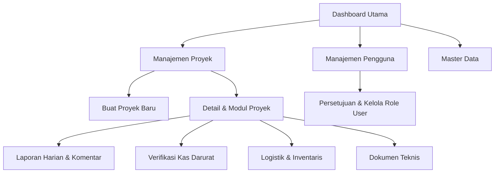
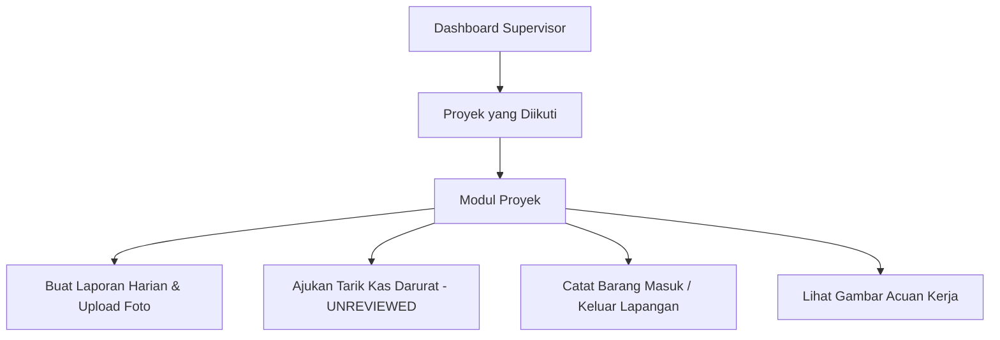
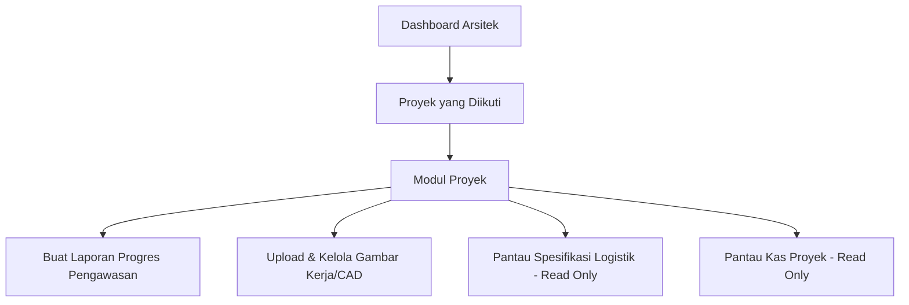
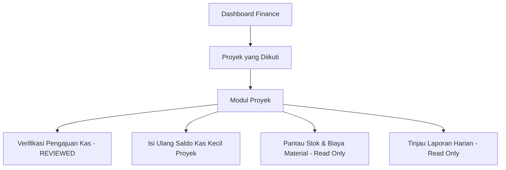
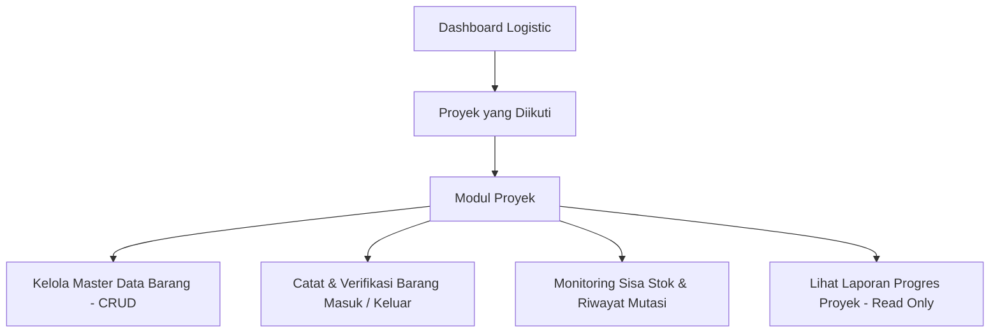

# 🏛️ Sandaran System — System Architecture

> **Dokumen Arsitektur Sistem, Infrastruktur Cloud, Siklus Autentikasi, dan Alur Navigasi Antarmuka.**

---

## 1. Stack Teknologi & Infrastruktur

Sandaran Internal System dibangun dengan teknologi modern yang dioptimalkan untuk kinerja tinggi, keamanan ketat, dan pengalaman pengguna mobile-first:

| Lapisan | Teknologi | Catatan Implementasi |
| :--- | :--- | :--- |
| **Framework** | Next.js 15 (App Router) + React 19 | Server Components secara default; client components hanya untuk interaktivitas (`"use client"`). |
| **Autentikasi** | Better Auth v1.3 + Prisma Adapter | Autentikasi berbasis session tersimpan di DB, mendukung multi-role dan approval guard. |
| **API Layer** | tRPC v11 + TanStack Query v5 + SuperJSON | End-to-end typesafe API; prosedur terisolasi dalam router fitur. |
| **ORM & Database** | Prisma v6 + PostgreSQL | Migrasi berbasis schema (`schema.prisma`) dan koneksi dioptimalkan untuk serverless. |
| **Infrastruktur Edge** | OpenNext + Cloudflare Workers / Pages | Serverless deployment di jaringan global Cloudflare. |
| **Database Pooling** | Cloudflare Hyperdrive (`HYPERDRIVE`) | Connection pooling berlatensi rendah antara Cloudflare Workers dan PostgreSQL. |
| **Media & Storage** | Cloudinary v2 | Direct signed client upload, signed asset deletion, dan manajemen folder per-proyek. |
| **Styling & UI** | Tailwind CSS v4 + shadcn/ui (Radix UI) | Desain token HSL, dark mode via `next-themes`, ikon dari `@tabler/icons-react`. |
| **Animasi & Motion** | GSAP 3 + Lenis Smooth Scroll | Khusus homepage scrollytelling (`SmoothScrollProvider`). |

---

## 2. Infrastruktur Cloud: Cloudflare Hyperdrive & Database Pooling

Sistem dirancang untuk berjalan di lingkungan Edge/Serverless Cloudflare dengan manajemen koneksi database yang aman dan efisien:

```
[ Browser / Klien ]
       │
       ▼
[ Cloudflare Workers (OpenNext) ]
       │
       │  (wrangler.jsonc: HYPERDRIVE binding)
       ▼
[ Cloudflare Hyperdrive ] ──── Connection Pool & Caching
       │
       ▼
[ PostgreSQL Database ]
```

### Logika Inisialisasi Database (`src/server/db.ts`)
1. **Runtime Cloudflare**: Sistem memeriksa ketersediaan binding `HYPERDRIVE` dari context Cloudflare (`cf.env.HYPERDRIVE`).
2. **Koneksi Dinamis**: Jika Hyperdrive terdeteksi, Prisma menggunakan `hyperdrive.connectionString` dengan ukuran pool `max: 5` tanpa verifikasi manual SSL.
3. **Local / Direct Fallback**: Jika berjalan di lingkungan development lokal tanpa Hyperdrive, koneksi menggunakan direct URL dengan `max: 1` dan SSL standar.

---

## 3. Media & File Storage: Cloudinary Pipeline

Seluruh file foto laporan harian, bukti transaksi kas darurat, dan dokumen teknis dikelola melalui Cloudinary:

```
[ Klien / Browser ]
       │
       ├─ 1. Minta Signed Parameters ─────────► [ tRPC: upload.getSignedUploadParams ]
       │                                                     │
       │  ◄── Balas Signature, API Key, Timestamp ───────────┘
       │
       ├─ 2. Direct Upload File (POST) ───────► [ Cloudinary Storage ]
       │                                                     │
       │  ◄── Balas public_id & secure_url ──────────────────┘
       │
       └─ 3. Simpan URL & public_id ke DB ───► [ tRPC Router (report / document) ]
```

- **Pencegahan Orphaned Storage**: Saat dokumen proyek atau bukti transaksi dihapus/diganti, backend secara otomatis memanggil `deleteCloudinaryAsset(publicId)` di Cloudinary sebelum atau bersamaan dengan penghapusan baris data di database.
- **Folder Berbasis Slug**: Folder Cloudinary disusun per proyek (`sandaran/[project-slug]/...`). Pembaruan slug proyek memicu `renameCloudinaryFolder` untuk menjaga kerapian struktur direktori aset.

---

## 4. Siklus Sesi & Hydration (Authentication Lifecycle)

Sistem menggunakan pola **Server-to-Client Hydration** untuk mendistribusikan data pengguna secara reaktif tanpa *prop drilling* atau duplikasi permintaan jaringan:

```
[ Server: Root Layout (src/app/layout.tsx) ]
       │
       │  1. auth.api.getSession()
       ▼
[ SessionInitializer Component ]
       │
       │  2. useSessionStore.getState().setSession(session)
       ▼
[ Zustand Store (src/stores/use-session-store.ts) ]
       │
       ├─────────────────────────────────┐
       ▼                                 ▼
[ Client Hook: useSession() ]    [ Client Hook: useUserRole() ]
- Data user (nama, email, foto)  - Status Admin & Executive
- Status akun (isActive)         - Hitung Project Roles (isSupervisor,
                                   isArchitect, isFinance, isLogistic)
```

### Route Protection Helpers

| Helper | File | Lingkungan | Tujuan |
| :--- | :--- | :--- | :--- |
| `requireAuth()` | `src/lib/server-auth.ts` | Server Components / Actions | Memastikan pengguna login & aktif. Mengarahkan ke `/login` atau `/waiting-approval`. |
| `requireAdmin()` | `src/lib/server-auth.ts` | Server Components / Actions | Memastikan role pengguna adalah `ADMIN` atau `EXECUTIVE` (sebelumnya `CEO`). |
| `useUserRole()` | `src/hooks/use-user-role.ts` | Client Components | Menyediakan boolean status role proyek untuk kondisional rendering UI (`isSupervisor`, dll). |
| `isAdmin(role)` | `src/lib/auth-guards.ts` | Server & Client | Pure helper untuk memeriksa apakah role adalah `ADMIN` atau `EXECUTIVE` (sebelumnya `CEO`). |

---

## 5. Peta Alur Antarmuka (UI Flow Map per Role)

Akses navigasi dan menu UI disesuaikan secara granular berdasarkan peran pengguna:

### A. Admin & Executive Flow
Admin dan Executive memiliki pandangan menyeluruh ke seluruh sistem. Executive memiliki akses pemantauan dan administratif serupa Admin:


### B. Supervisor Flow
Supervisor (sebelumnya Mandor) beroperasi di lapangan dalam proyek yang ditugaskan:


### C. Architect Flow
Arsitek mengawasi kesesuaian gambar dan spesifikasi desain:


### D. Finance Flow
Finance mengontrol anggaran kas kecil dan memantau biaya material:


### E. Logistic Flow
Logistic mengelola rantai pasok material dan inventaris gudang:

