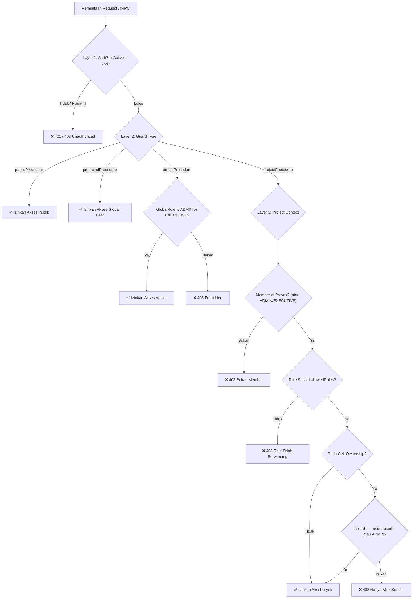

# 🔐 Sandaran System — Permissions & Roles Guide

> **Single Source of Truth** untuk hierarki peran, matriks perizinan, dan panduan teknis pembuatan prosedur tRPC.

---

## 1. Konsep Peran (Role Architecture)

Sistem menggunakan model perizinan berlapis (**3-Layer Security**) yang memisahkan otoritas level sistem dengan otoritas level proyek.

```
Layer 1: Autentikasi
└── User login valid & akun aktif (isActive = true, reviewedAt terisi)

Layer 2: Global Role Check
├── ADMIN & EXECUTIVE : Memiliki hak admin level sistem (adminProcedure)
└── USER              : Memerlukan penugasan proyek untuk aksi operasional

Layer 3: Project Context Check
└── Bergantung pada ProjectRole (SUPERVISOR | ARCHITECT | FINANCE | LOGISTIC)
```

### A. Global Roles (`GlobalRole` Enum)

Role sistem yang melekat permanen pada profil pengguna:

| Role | Kode | Hak Akses Sistem & Catatan |
| :--- | :--- | :--- |
| **Administrator** | `ADMIN` | **Superuser.** Akses penuh ke seluruh menu, user management, pembuatan proyek, dan bypass kepemilikan data. |
| **Executive** | `EXECUTIVE` | **Executive Access (sebelumnya CEO).** Memiliki akses `adminProcedure` (dapat memantau sistem, menyetujui user, dan membuat proyek) serta memantau seluruh proyek tanpa perlu terdaftar sebagai member. |
| **User** | `USER` | **Akses Standar.** Akses operasional proyek ditentukan oleh `ProjectRole` di mana user ditugaskan. |
| **None** | `NONE` | **User Menunggu Persetujuan.** Tidak memiliki akses operasional hingga disetujui (`/waiting-approval`). |

> **Catatan Keselarasan Kode:** Pada tRPC guard `adminProcedure`, fungsi pengecekan `isAdmin(role)` memvalidasi apakah user memiliki role `ADMIN` atau `EXECUTIVE` (sebelumnya `CEO`). Oleh karena itu, baik Admin maupun Executive memiliki akses ke endpoint administratif (manajemen pengguna dan inisiasi proyek).

---

### B. Project Roles (`ProjectRole` Enum)

Role dinamis yang diberikan per proyek melalui tabel `ProjectMember`. Satu pengguna dapat memiliki role berbeda pada proyek yang berbeda:

| Role | Kode | Fokus & Tanggung Jawab Operasional |
| :--- | :--- | :--- |
| **Supervisor** | `SUPERVISOR` | **Operasional Lapangan (sebelumnya Mandor):** Menginput laporan harian, mengajukan dana darurat, dan mencatat mutasi barang keluar/masuk langsung di lokasi proyek. |
| **Architect** | `ARCHITECT` | **Teknis & Perencanaan:** Menginput laporan harian pengawasan, mengunggah dan mengelola dokumen teknis (gambar kerja, CAD, spesifikasi). |
| **Finance** | `FINANCE` | **Kontrol Biaya & Kas:** Memverifikasi pengajuan dana darurat, mengisi ulang kas kecil proyek (*top-up*), memantau stok dan anggaran material (*read-only*). |
| **Logistic** | `LOGISTIC` | **Material & Rantai Pasok:** Mengelola master data item material (tambah, edit, hapus), mencatat dan memverifikasi mutasi stok masuk (`IN`) dan keluar (`OUT`), serta mengontrol inventaris. |

---

## 2. Diagram Alur Izin (Permission Flow)



---

## 3. Matriks Hak Akses Lengkap

### Legend
- ✅ : Akses Penuh
- 🟢 : Bersyarat (*Ownership check* — hanya data milik sendiri)
- 📖 : Read-Only (Hanya Lihat)
- ❌ : Tidak Ada Akses

---

### A. Tindakan Global (Tanpa Konteks Proyek)

| Aksi / Prosedur | ADMIN | EXECUTIVE | USER | Catatan |
| :--- | :---: | :---: | :---: | :--- |
| `SYSTEM_ACCESS` | ✅ | ✅ | ✅ | User aktif dan disetujui (`roleGlobal != NONE`) |
| `USER_MANAGEMENT` | ✅ | ✅ | ❌ | List, approve, dan kelola peran user (`adminProcedure`) |
| `PROJECT_CREATE` | ✅ | ✅ | ❌ | Inisiasi proyek baru (`adminProcedure`) |
| `PROJECT_LIST_ALL` | ✅ | ✅ | ❌ | Membaca semua proyek tanpa filter member |
| `PROFILE_EDIT_OWN` | ✅ | ✅ | ✅ | Setiap user berhak mengedit profil sendiri |

---

### B. Tindakan Berbasis Proyek (Project-Scoped)

#### 1. Proyek & Anggota
| Modul / Aksi | ADMIN | EXECUTIVE | SUPERVISOR | ARCHITECT | FINANCE | LOGISTIC | Catatan |
| :--- | :---: | :---: | :---: | :---: | :---: | :---: | :--- |
| **Lihat Detail Proyek** | ✅ | 📖 | ✅ | ✅ | ✅ | ✅ | Anggota melihat proyek yang diikutinya |
| **Kelola Member Proyek** | ✅ | ✅ | ❌ | ❌ | ❌ | ❌ | Admin & Executive dapat menambah/mengubah anggota |
| **Edit Data Proyek** | ✅ | ✅ | ❌ | ❌ | ❌ | ❌ | Update nama, deskripsi, tenggat waktu |

#### 2. Laporan Harian (Daily Reports)
| Modul / Aksi | ADMIN | EXECUTIVE | SUPERVISOR | ARCHITECT | FINANCE | LOGISTIC | Catatan |
| :--- | :---: | :---: | :---: | :---: | :---: | :---: | :--- |
| **Buat Laporan** | ✅ | ❌ | ✅ | ✅ | ❌ | ❌ | Pelaksana & pengawas lapangan |
| **Edit / Hapus Laporan** | ✅ | ❌ | 🟢 | 🟢 | ❌ | ❌ | Hanya laporan buatan sendiri (Admin bypass) |
| **Upload Foto Laporan** | ✅ | ❌ | 🟢 | 🟢 | ❌ | ❌ | Hanya ke laporan milik sendiri |
| **Komentar Laporan** | ✅ | ✅ | ✅ | ✅ | ✅ | ✅ | Seluruh pihak & Executive dapat berdiskusi |
| **Lihat Laporan** | ✅ | 📖 | ✅ | ✅ | ✅ | ✅ | Transparansi seluruh anggota proyek |

#### 3. Dana Darurat (Emergency Fund / Kas Kecil)
| Modul / Aksi | ADMIN | EXECUTIVE | SUPERVISOR | ARCHITECT | FINANCE | LOGISTIC | Catatan |
| :--- | :---: | :---: | :---: | :---: | :---: | :---: | :--- |
| **Ajukan Penarikan (Withdraw)** | ✅ | ❌ | ✅ | ❌ | ❌ | ❌ | Status awal: `UNREVIEWED` |
| **Verifikasi Penarikan** | ✅ | ❌ | ❌ | ❌ | ✅ | ❌ | Status diubah menjadi: `REVIEWED` |
| **Top-up / Saldo Kas** | ✅ | ❌ | ❌ | ❌ | ✅ | ❌ | Menambah saldo kas proyek |
| **Lihat Saldo & Transaksi** | ✅ | 📖 | ✅ | ✅ | ✅ | ✅ | Seluruh anggota dapat memantau saldo |

#### 4. Logistik & Material Proyek
| Modul / Aksi | ADMIN | EXECUTIVE | SUPERVISOR | ARCHITECT | FINANCE | LOGISTIC | Catatan |
| :--- | :---: | :---: | :---: | :---: | :---: | :---: | :--- |
| **Kelola Master Item (CRUD)** | ✅ | ❌ | ❌ | ❌ | ❌ | ✅ | Tambah, edit nama/satuan, hapus item |
| **Catat Transaksi IN / OUT** | ✅ | ❌ | ✅ | ❌ | ❌ | ✅ | Supervisor (lapangan) & Logistic (gudang) |
| **Lihat Stok & Riwayat Mutasi** | ✅ | 📖 | ✅ | 📖 | 📖 | ✅ | Finance & Architect monitoring stok |

#### 5. Dokumen Teknis Proyek
| Modul / Aksi | ADMIN | EXECUTIVE | SUPERVISOR | ARCHITECT | FINANCE | LOGISTIC | Catatan |
| :--- | :---: | :---: | :---: | :---: | :---: | :---: | :--- |
| **Upload Dokumen Kerja** | ✅ | ❌ | ❌ | ✅ | ❌ | ❌ | Gambar teknis, CAD, referensi desain |
| **Edit / Hapus Dokumen** | ✅ | ❌ | ❌ | 🟢 | ❌ | ❌ | Hanya dokumen milik sendiri |
| **Lihat & Unduh Dokumen** | ✅ | 📖 | ✅ | ✅ | ✅ | ✅ | Supervisor/Logistic melihat acuan spesifikasi |

---

## 4. Panduan Developer tRPC (Quick Reference)

### A. Decision Tree Pemilihan Procedure

```
1. Apakah endpoint butuh login?
   ├─ TIDAK → Gunakan publicProcedure
   └─ YA    → Lanjut ke langkah 2 ↓

2. Apakah endpoint hanya untuk Administrator / Executive?
   ├─ YA    → Gunakan adminProcedure
   └─ TIDAK → Lanjut ke langkah 3 ↓

3. Apakah butuh konteks spesifik sebuah proyek?
   ├─ TIDAK → Gunakan protectedProcedure
   └─ YA    → Gunakan projectProcedure([roles...])

4. Apakah operasi perubahan data butuh verifikasi pemilik data?
   └─ YA    → Tambahkan ownership check di dalam mutasi (Admin bypass)
```

### B. Prosedur yang Tersedia di `src/server/api/trpc.ts`

| Prosedur | Kapan Digunakan | Konteks yang Disediakan |
| :--- | :--- | :--- |
| `publicProcedure` | Informasi publik atau pengecekan server | `ctx.db` |
| `protectedProcedure` | Pengguna yang sudah login aktif | `ctx.session.user`, `ctx.db` |
| `adminProcedure` | Khusus pengguna dengan `roleGlobal === 'ADMIN' \|\| 'EXECUTIVE'` | `ctx.session.user` (jaminan Admin/Executive) |
| `projectProcedure(roles)` | Prosedur operasional modul proyek | `ctx.projectId`, `ctx.projectRole`, `ctx.session` |

### C. Contoh Implementasi

#### 1. Prosedur Modul Logistik
```typescript
import { createTRPCRouter, projectProcedure } from "~/server/api/trpc";
import { z } from "zod";

// Hanya LOGISTIC yang mengelola item
const logisticAdminProcedure = projectProcedure(["LOGISTIC"]);

// LOGISTIC dan SUPERVISOR dapat mencatat mutasi
const logisticMutationProcedure = projectProcedure(["LOGISTIC", "SUPERVISOR"]);

export const logisticRouter = createTRPCRouter({
  createItem: logisticAdminProcedure
    .input(z.object({ projectId: z.string(), name: z.string(), unit: z.string() }))
    .mutation(async ({ ctx, input }) => {
      return ctx.db.logisticItem.create({
        data: { projectId: ctx.projectId, name: input.name, unit: input.unit },
      });
    }),

  recordTransaction: logisticMutationProcedure
    .input(z.object({ projectId: z.string(), itemId: z.string(), type: z.enum(["IN", "OUT"]), quantity: z.number() }))
    .mutation(async ({ ctx, input }) => {
      // ctx.projectId dan ctx.projectRole sudah tervalidasi
    }),
});
```

#### 2. Pola Ownership Check
```typescript
const report = await ctx.db.dailyReport.findUniqueOrThrow({ where: { id: input.reportId } });

// Admin bypass ownership
if (ctx.session.user.roleGlobal !== "ADMIN" && report.userId !== ctx.session.user.id) {
  throw new TRPCError({
    code: "FORBIDDEN",
    message: "Hanya dapat mengubah laporan milik sendiri",
  });
}
```
