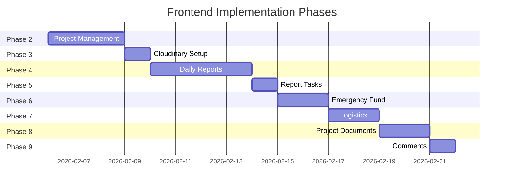

# Frontend UI Implementation Plan

> **Dokumen perencanaan untuk pembuatan UI Sandaran Internal System**

---

## 📋 Overview

Implementasi frontend UI untuk sistem internal manajemen proyek konstruksi dengan fitur:

- Project Management
- Daily Reports dengan media upload
- Emergency Fund tracking
- Logistics management
- Project Documents

**Tech Stack:**

- Next.js 15 (App Router)
- shadcn/ui components
- TanStack Form + Zod validation
- Cloudinary (media storage)
- tRPC (existing)

---

## 🔄 Phase Breakdown



---

## Phase 2: Project Management

### Proposed Changes

#### [NEW] [project-list-columns.tsx](file:///d:/Haqqi%20Sukmara/NextJS/sandaran-internal-system/src/components/project/project-list-columns.tsx)

Column definitions untuk DataTable dengan:

- Name, Status, Location, Start Date, Members count
- Actions: View, Edit, Delete (role-based)

#### [NEW] [project-table.tsx](file:///d:/Haqqi%20Sukmara/NextJS/sandaran-internal-system/src/components/project/project-table.tsx)

DataTable dengan pagination, filter, search, sorting

#### [NEW] [project-form.tsx](file:///d:/Haqqi%20Sukmara/NextJS/sandaran-internal-system/src/components/project/project-form.tsx)

Form menggunakan TanStack Form + Zod:

```typescript
const projectSchema = z.object({
  name: z.string().min(1, "Name required"),
  slug: z.string().min(1, "Slug required"),
  description: z.string().optional(),
  location: z.string().optional(),
  startDate: z.date().optional(),
  endDate: z.date().optional(),
  status: z.enum(["ACTIVE", "DONE", "PAUSED"]),
});
```

#### [NEW] [project-dialog.tsx](file:///d:/Haqqi%20Sukmara/NextJS/sandaran-internal-system/src/components/project/project-dialog.tsx)

Dialog untuk create/edit project (responsive sheet di mobile)

#### [NEW] [member-management.tsx](file:///d:/Haqqi%20Sukmara/NextJS/sandaran-internal-system/src/components/project/member-management.tsx)

- Add member dengan role selector
- Update member role
- Remove member dengan konfirmasi

#### [MODIFY] [page.tsx](<file:///d:/Haqqi%20Sukmara/NextJS/sandaran-internal-system/src/app/(internal)/projects/page.tsx>)

Update untuk menggunakan komponen baru

#### [NEW] [page.tsx](<file:///d:/Haqqi%20Sukmara/NextJS/sandaran-internal-system/src/app/(internal)/projects/[slug]/page.tsx>)

Project detail page dengan tabs

---

## Phase 3: Cloudinary Setup

### Proposed Changes

#### [NEW] [cloudinary.ts](file:///d:/Haqqi%20Sukmara/NextJS/sandaran-internal-system/src/lib/cloudinary.ts)

```typescript
// Configuration & upload utilities
export const uploadImage = async (file: File, options?: UploadOptions) => {
  // Resize/compress before upload
  // Max 5MB, auto format optimization
}

export const deleteAsset = async (publicId: string) => { ... }
```

#### [NEW] [upload.ts](file:///d:/Haqqi%20Sukmara/NextJS/sandaran-internal-system/src/server/api/routers/upload.ts)

Signed upload endpoint untuk keamanan

#### [NEW] [image-upload.tsx](file:///d:/Haqqi%20Sukmara/NextJS/sandaran-internal-system/src/components/shared/image-upload.tsx)

Reusable component dengan:

- Drag & drop
- Preview
- Progress bar
- Client-side compression (browser-image-compression)

---

## Phase 4: Daily Reports

### Proposed Changes

#### [NEW] [report-card.tsx](file:///d:/Haqqi%20Sukmara/NextJS/sandaran-internal-system/src/components/report/report-card.tsx)

Card view untuk list report (mobile-friendly)

#### [NEW] [report-list.tsx](file:///d:/Haqqi%20Sukmara/NextJS/sandaran-internal-system/src/components/report/report-list.tsx)

List dengan pagination, filter by date/author

#### [NEW] [report-form.tsx](file:///d:/Haqqi%20Sukmara/NextJS/sandaran-internal-system/src/components/report/report-form.tsx)

TanStack Form dengan:

```typescript
const reportSchema = z.object({
  reportDate: z.date(),
  taskDescription: z.string().min(1),
  progressPercent: z.number().min(0).max(100),
  issues: z.string().optional(),
  weather: z.string().optional(),
  totalWorkers: z.number().min(0),
  location: z.string().optional(),
});
```

#### [NEW] [report-dialog.tsx](file:///d:/Haqqi%20Sukmara/NextJS/sandaran-internal-system/src/components/report/report-dialog.tsx)

Sheet untuk create/edit report

#### [NEW] [media-gallery.tsx](file:///d:/Haqqi%20Sukmara/NextJS/sandaran-internal-system/src/components/report/media-gallery.tsx)

Gallery view untuk report media dengan lightbox

#### [NEW] [page.tsx](<file:///d:/Haqqi%20Sukmara/NextJS/sandaran-internal-system/src/app/(internal)/projects/[slug]/reports/page.tsx>)

Report list page per project

#### [NEW] [page.tsx](<file:///d:/Haqqi%20Sukmara/NextJS/sandaran-internal-system/src/app/(internal)/projects/[slug]/reports/[reportSlug]/page.tsx>)

Report detail page

---

## Phase 5: Report Task Breakdown

### Proposed Changes

#### [NEW] [task-list.tsx](file:///d:/Haqqi%20Sukmara/NextJS/sandaran-internal-system/src/components/report/task-list.tsx)

List tasks dalam report

#### [NEW] [task-form.tsx](file:///d:/Haqqi%20Sukmara/NextJS/sandaran-internal-system/src/components/report/task-form.tsx)

Inline form untuk add/edit task

---

## Phase 6: Emergency Fund

### Proposed Changes

#### [NEW] [fund-overview.tsx](file:///d:/Haqqi%20Sukmara/NextJS/sandaran-internal-system/src/components/emergency/fund-overview.tsx)

Card showing current balance, pending requests count

#### [NEW] [transaction-list.tsx](file:///d:/Haqqi%20Sukmara/NextJS/sandaran-internal-system/src/components/emergency/transaction-list.tsx)

DataTable untuk transaction history

#### [NEW] [request-form.tsx](file:///d:/Haqqi%20Sukmara/NextJS/sandaran-internal-system/src/components/emergency/request-form.tsx)

Form untuk MANDOR request dana

#### [NEW] [verify-dialog.tsx](file:///d:/Haqqi%20Sukmara/NextJS/sandaran-internal-system/src/components/emergency/verify-dialog.tsx)

Dialog untuk FINANCE approve/reject

#### [NEW] [page.tsx](<file:///d:/Haqqi%20Sukmara/NextJS/sandaran-internal-system/src/app/(internal)/projects/[slug]/emergency/page.tsx>)

Emergency fund page per project

---

## Phase 7: Logistics

### Proposed Changes

#### [NEW] [item-list.tsx](file:///d:/Haqqi%20Sukmara/NextJS/sandaran-internal-system/src/components/logistic/item-list.tsx)

DataTable untuk logistic items dengan stock summary

#### [NEW] [item-form.tsx](file:///d:/Haqqi%20Sukmara/NextJS/sandaran-internal-system/src/components/logistic/item-form.tsx)

Form create/edit item

#### [NEW] [transaction-form.tsx](file:///d:/Haqqi%20Sukmara/NextJS/sandaran-internal-system/src/components/logistic/transaction-form.tsx)

Form untuk IN/OUT transaction

#### [NEW] [page.tsx](<file:///d:/Haqqi%20Sukmara/NextJS/sandaran-internal-system/src/app/(internal)/projects/[slug]/logistics/page.tsx>)

Logistics page per project

---

## Phase 8: Project Documents

### Proposed Changes

#### [NEW] [document-gallery.tsx](file:///d:/Haqqi%20Sukmara/NextJS/sandaran-internal-system/src/components/document/document-gallery.tsx)

Grid view documents dengan filter by type

#### [NEW] [upload-dialog.tsx](file:///d:/Haqqi%20Sukmara/NextJS/sandaran-internal-system/src/components/document/upload-dialog.tsx)

Dialog upload dengan:

- File picker (PDF, Excel)
- Metadata fields (title, version, type)

#### [NEW] [page.tsx](<file:///d:/Haqqi%20Sukmara/NextJS/sandaran-internal-system/src/app/(internal)/projects/[slug]/documents/page.tsx>)

Documents page per project

---

## Phase 9: Comments

### Proposed Changes

#### [NEW] [comment-list.tsx](file:///d:/Haqqi%20Sukmara/NextJS/sandaran-internal-system/src/components/comment/comment-list.tsx)

Comment thread pada report

#### [NEW] [comment-form.tsx](file:///d:/Haqqi%20Sukmara/NextJS/sandaran-internal-system/src/components/comment/comment-form.tsx)

Textarea untuk add comment

---

## 🎨 UI/UX Guidelines

### Component Patterns

| Component    | Desktop         | Mobile              |
| ------------ | --------------- | ------------------- |
| Form dialogs | Dialog          | Sheet (full height) |
| Data list    | DataTable       | Cards               |
| Actions      | Visible buttons | Dropdown menu       |
| Navigation   | Sidebar         | Collapsible sidebar |

### Role-Based UI

```typescript
// Helper untuk hide/show berdasarkan role
const canPerformAction = (action: string, userRole: GlobalRole, projectRole?: ProjectRole) => {
  // Check permission matrix
}

// Usage
{canPerformAction("REPORT_CREATE", role, projectRole) && (
  <Button>Create Report</Button>
)}
```

---

## 🔧 Technical Decisions

### 1. Form Library

- **TanStack Form + Zod** sesuai request
- Akan install: `@tanstack/react-form`, `zod`

### 2. Image Compression

- **browser-image-compression** untuk client-side
- Max 5MB setelah kompresi
- Auto-convert ke WebP via Cloudinary

### 3. File Types

| Feature      | Supported Formats      |
| ------------ | ---------------------- |
| Report Media | JPG, JPEG, PNG, WebP   |
| Documents    | PDF, Excel (xlsx, xls) |

### 4. Real-time (Future)

- Consider: Pusher atau polling untuk notifikasi
- Scope: Pending approvals, new comments

---

## ✅ Verification Plan

### Per Phase Testing

1. **Visual**: Responsive layout check (desktop, tablet, mobile)
2. **Functional**: CRUD operations via UI
3. **Permission**: Role-based visibility
4. **Edge cases**: Empty states, error handling, loading states

### Browser Testing

- Chrome (primary)
- Safari (iOS)
- Firefox

---

## 📦 Dependencies to Install

```bash
pnpm add @tanstack/react-form zod
pnpm add browser-image-compression
pnpm add cloudinary
pnpm add @tanstack/react-table  # if not installed
```

---

## User Review Required

> [!IMPORTANT]
> **Pilih preferensi untuk memulai Phase 2:**
>
> 1. Apakah struktur folder komponen sudah sesuai? (misal: `src/components/project/`, `src/components/report/`)
> 2. Untuk routing project detail, apakah prefer `/projects/[slug]` atau `/projects/[id]`?
> 3. Apakah perlu install TanStack Table jika belum ada, atau gunakan table component yang sudah ada?

---

**Estimated Total Effort:** 16-20 days  
**Document Version:** 1.0  
**Created:** 2026-02-05
