# 🎨 Permission Flow Diagrams

> **Visual representation of 3-Layer Permission System**

---

## 1️⃣ Overall Permission Flow (High-Level)

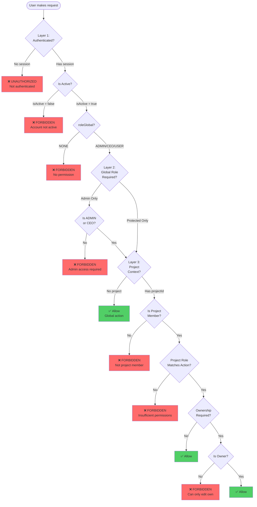

---

## 2️⃣ Layer 1: Authentication Guard (Already Implemented)

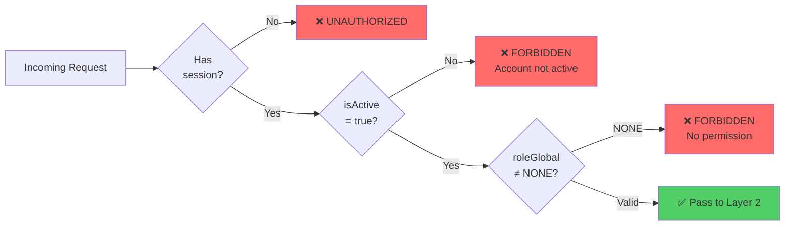

---

## 3️⃣ Layer 2: Global Role Guard (Already Implemented)

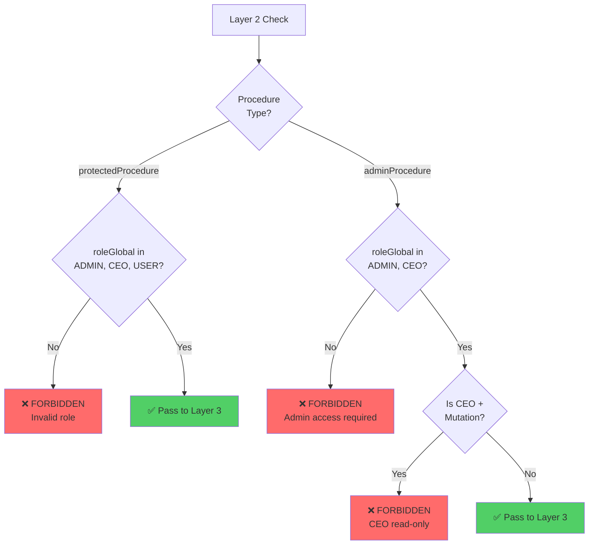

---

## 4️⃣ Layer 3: Project Context Guard (To Be Implemented)

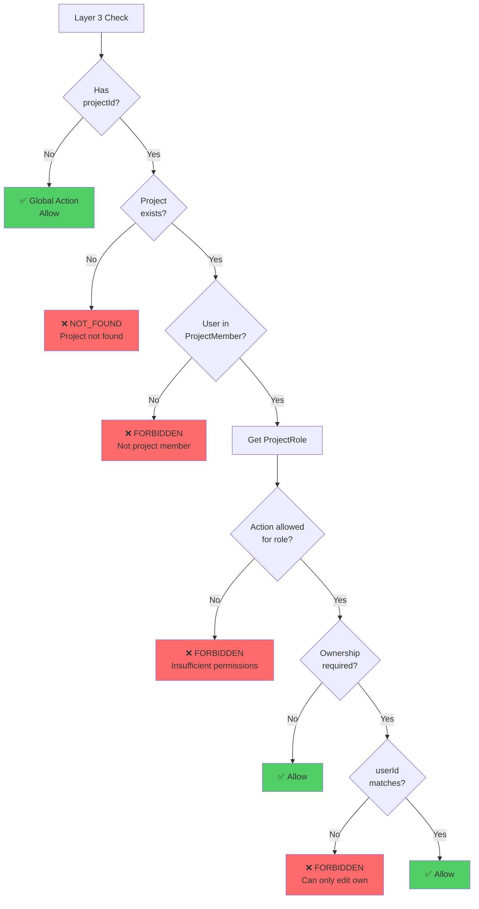

---

## 5️⃣ Ownership Guard Flow

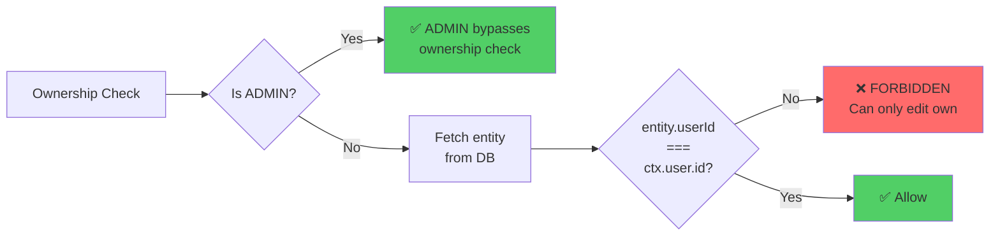

---

## 6️⃣ Role-Specific Flows

### A. MANDOR Flow

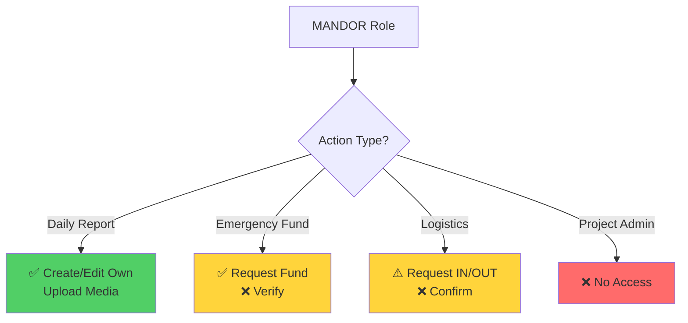

### B. ARCHITECT Flow

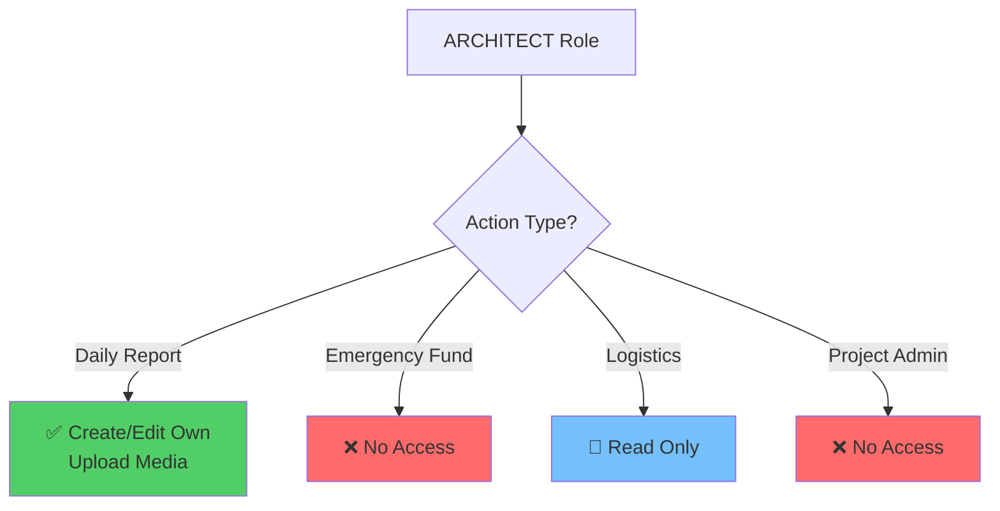

### C. FINANCE Flow

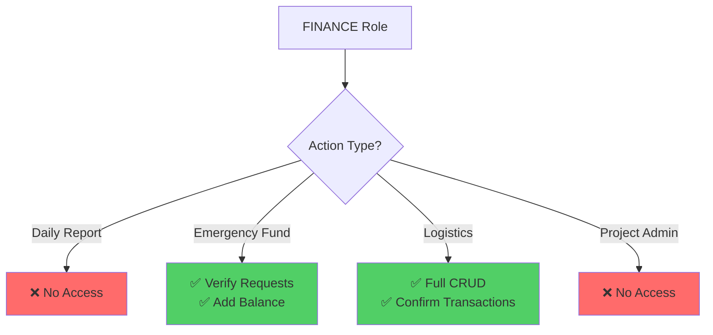

---

## 7️⃣ Emergency Fund Workflow

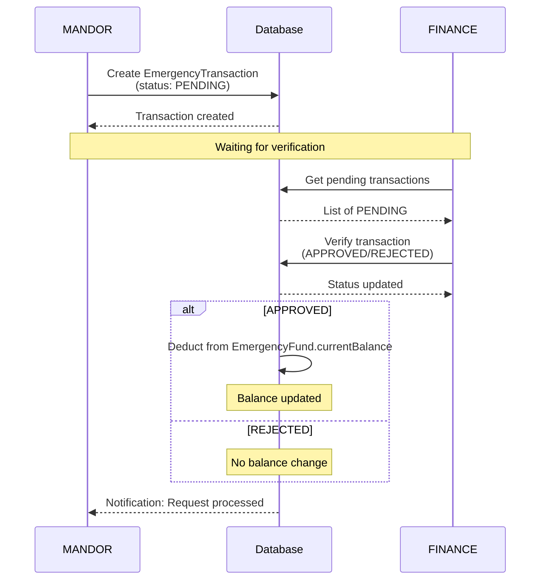

---

## 8️⃣ Logistic Transaction Workflow (MANDOR Limited)

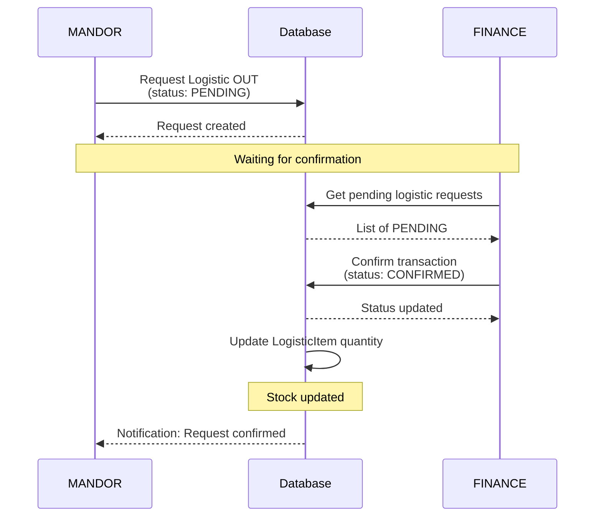

---

## 9️⃣ CEO Read-Only Enforcement

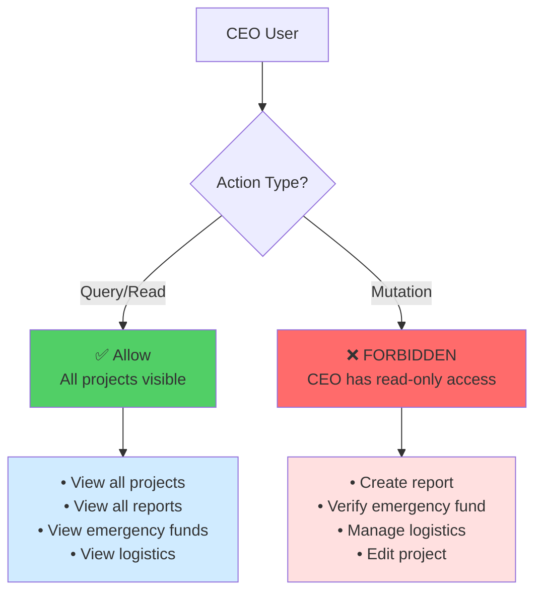

---

## 🎯 Legend

| Color     | Meaning               |
| --------- | --------------------- |
| 🟢 Green  | Allowed / Success     |
| 🔴 Red    | Forbidden / Error     |
| 🟡 Yellow | Conditional / Limited |
| 🔵 Blue   | Read-only             |

---

**Document Version:** 1.0  
**Companion to:** [permission-matrix.md](file:///C:/Users/haqqi/.gemini/antigravity/brain/e7ca4093-7a8e-446d-92a7-8ac291978fb5/permission-matrix.md)
