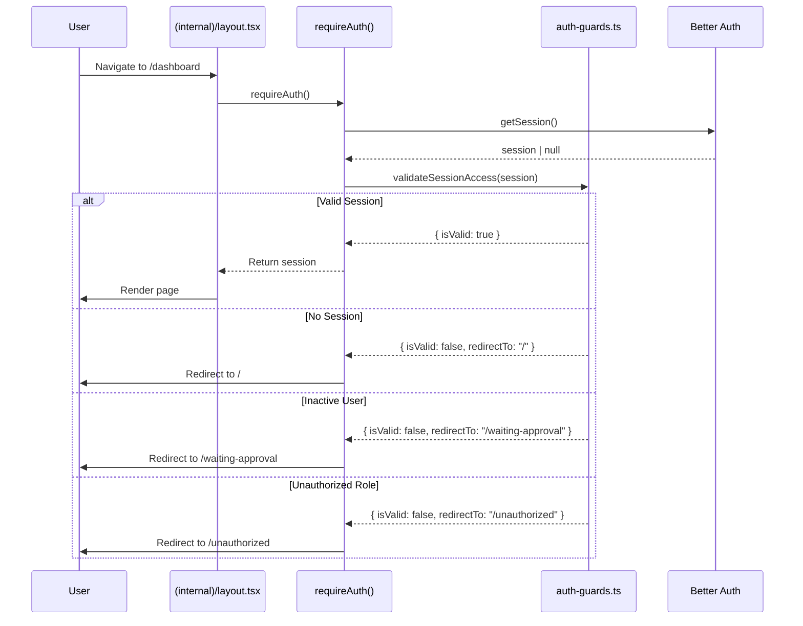
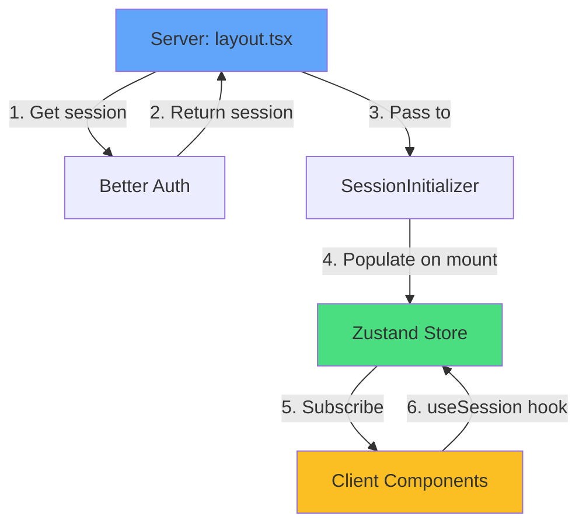
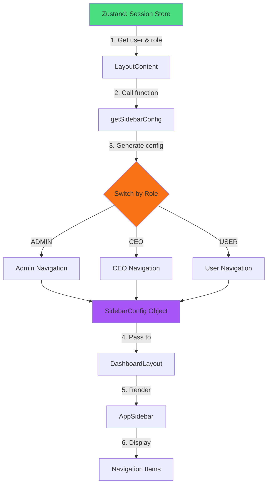

# Phase 1 Summary: Architecture & Data Flow

Complete overview of the refactored internal pages system with authentication, state management, and flexible layouts.

---

## 📐 Component Hierarchy

### Full Tree Structure

```
app/
└── (internal)/
    ├── layout.tsx (Server) 🔒
    │   ├── SessionInitializer (Client)
    │   └── InternalLayoutClient (Client)
    │       └── LayoutProvider (Context)
    │           └── LayoutContent
    │               └── DashboardLayout
    │                   ├── AppSidebar
    │                   │   ├── NavMain
    │                   │   │   ├── ProjectSelector
    │                   │   │   └── Navigation Links
    │                   │   ├── NavDocuments
    │                   │   ├── NavSecondary
    │                   │   └── NavUser
    │                   └── SiteHeader
    │                       ├── Header Title (dynamic)
    │                       └── Header Actions (dynamic)
    │
    ├── dashboard/
    │   └── page.tsx (Client)
    │       └── PageLayout
    │           ├── SectionCards
    │           └── ChartAreaInteractive
    │
    └── projects/
        └── page.tsx (Client)
            └── PageLayout
                └── Project Content
```

---

## 🔄 Data Flow Architecture

### 1. Authentication Flow



**Layer Description:**

1. **Server Layer** (`layout.tsx`) - Validates auth before rendering
2. **Auth Helper** (`requireAuth()`) - Coordinates session checks
3. **Guard Logic** (`validateSessionAccess()`) - Business rules
4. **Session Provider** (Better Auth) - Session data source

---

### 2. State Management Flow



**State Flow Steps:**

1. **Server fetches** - `requireAuth()` gets session from Better Auth
2. **Server passes** - `<SessionInitializer session={session} />`
3. **Client initializes** - `useEffect` populates Zustand store
4. **Components consume** - `useSession()` hook reads from store
5. **Reactive updates** - Components re-render on state changes

**Key Files:**

- `stores/use-session-store.ts` - Zustand store definition
- `providers/session-initializer.tsx` - Server-to-client bridge
- Any component - Uses `useSession()` hook

---

### 3. Layout Customization Flow

```mermaid
flowchart LR
    Page[Page Component] -->|1. Set config| PageLayout[PageLayout Helper]
    PageLayout -->|2. useEffect| UpdateConfig[updateConfig function]
    UpdateConfig -->|3. Update state| Provider[LayoutProvider Context]
    Provider -->|4. Read config| LayoutContent[LayoutContent Component]
    LayoutContent -->|5. Pass props| DashboardLayout[DashboardLayout]
    DashboardLayout -->|6. Render| Header[SiteHeader with title/actions]

    style Page fill:#fbbf24
    style Provider fill:#4ade80
    style Header fill:#60a5fa
```



**Customization Flow:**

1. **Page declares** - `<PageLayout title="Projects" actions={...}>`
2. **Helper updates** - `useEffect` calls `updateConfig()`
3. **Context stores** - `LayoutProvider` state updated
4. **Layout reads** - `LayoutContent` gets `config` from context
5. **Props passed** - `DashboardLayout` receives title/actions
6. **Header renders** - `SiteHeader` displays dynamic content

**Example:**

```tsx
// Page sets configuration
<PageLayout title="Projects" actions={<Button>New</Button>}>
  <Content />
</PageLayout>

// Layout reads and renders
<SiteHeader
  title={config.headerTitle}  // "Projects"
  actions={config.headerActions}  // <Button>New</Button>
/>
```

---

### 4. Sidebar Configuration Flow



**Role-Based Navigation:**

```typescript
// ADMIN sees:
- Dashboard
- Projects
- Users
- Documents

// CEO sees:
- Dashboard
- All Projects
- Reports

// USER sees:
- Dashboard
- My Reports
- Emergency Funds
- Logistics
```

---

## 🗂️ File Organization

### Core System Files

```
src/
├── app/
│   └── (internal)/
│       ├── layout.tsx              # Server auth + session init
│       ├── dashboard/page.tsx      # Dashboard page
│       └── projects/page.tsx       # Projects page
│
├── components/
│   ├── layout/
│   │   ├── internal-layout-client.tsx  # Main layout wrapper
│   │   ├── dashboard-layout.tsx        # UI shell structure
│   │   ├── page-layout.tsx             # Helper for pages
│   │   ├── app-sidebar.tsx             # Sidebar container
│   │   └── site-header.tsx             # Header bar
│   │
│   ├── navigation/
│   │   ├── nav-main.tsx                # Main nav items
│   │   ├── project-selector.tsx        # Project switcher
│   │   ├── nav-documents.tsx           # Document links
│   │   ├── nav-secondary.tsx           # Secondary links
│   │   └── nav-user.tsx                # User menu
│   │
│   └── providers/
│       ├── session-initializer.tsx     # Session bridge
│       └── layout-provider.tsx         # Layout context
│
├── stores/
│   └── use-session-store.ts        # Zustand session state
│
└── lib/
    ├── auth-guards.ts              # Validation logic
    └── server-auth.ts              # Server helpers
```

---

## 🔐 Security Layers

### Multi-Layer Protection

```
Layer 1: Server Component (layout.tsx)
  ↓ requireAuth() - Mandatory auth check

Layer 2: Auth Guards (auth-guards.ts)
  ↓ validateSessionAccess() - Business rules

Layer 3: Better Auth Session
  ↓ getSession() - Session verification

Layer 4: Middleware (optional)
  ↓ Route-level protection
```

**Validation Rules:**

1. ✅ Session exists
2. ✅ User is active (`isActive === true`)
3. ✅ Role is authorized (`ADMIN | CEO | USER`)
4. ✅ Not suspended/banned

**Redirect Mapping:**

- No session → `/` (Login page)
- Inactive user → `/waiting-approval`
- Unauthorized role → `/unauthorized`

---

## 📊 State Management

### Zustand Store Structure

```typescript
interface SessionState {
  session: Session | null;
  setSession: (session: Session | null) => void;
}

// Usage in components
const { user, role, isActive } = useSession();
```

### Context State Structure

```typescript
interface LayoutConfig {
  headerTitle?: string;
  headerActions?: ReactNode;
  hideSidebar?: boolean;
}

// Usage in pages
const { updateConfig } = useLayout();
updateConfig({ headerTitle: "Projects" });
```

---

## 🎯 Key Design Patterns

### 1. Server/Client Separation

- **Server**: Auth, data fetching, validation
- **Client**: UI interactions, state management

### 2. Context for Configuration

- **LayoutProvider**: Page-level customization
- **Zustand**: Global session state

### 3. Composition Pattern

```tsx
<Layout>
  <LayoutProvider>
    <DashboardLayout>
      <Sidebar />
      <Header />
      <Content />
    </DashboardLayout>
  </LayoutProvider>
</Layout>
```

### 4. Role-Based Rendering

```tsx
const config = getSidebarConfig(user, role);
// Different navigation per role
```

---

## 🚀 Page Creation Pattern

### Simple Page Template

```tsx
"use client";
import { PageLayout } from "~/components/layout";

export default function NewPage() {
  return (
    <PageLayout title="Page Title">
      <div className="p-4">{/* Your content */}</div>
    </PageLayout>
  );
}
```

**Auto-included:**

- ✅ Authentication (layout handles)
- ✅ Sidebar with navigation
- ✅ Header with title
- ✅ Session access via `useSession()`

### With Custom Actions

```tsx
<PageLayout title="Projects" actions={<Button>New Project</Button>}>
  <Content />
</PageLayout>
```

---

## 📈 Benefits Achieved

| Aspect             | Before             | After               |
| ------------------ | ------------------ | ------------------- |
| **Auth Check**     | Manual per page    | Automatic (layout)  |
| **Session Access** | Props drilling     | Zustand hook        |
| **Sidebar Config** | Duplicate per page | Shared (role-based) |
| **Header Custom**  | Hard-coded         | Dynamic (context)   |
| **Code per Page**  | ~70 lines          | ~15 lines           |
| **Type Safety**    | Partial            | Full TypeScript     |

---

## 🎨 Architecture Principles

1. **DRY** - Don't Repeat Yourself
   - Auth logic once (layout)
   - Sidebar config once (shared)
   - Layout structure once (DashboardLayout)

2. **Separation of Concerns**
   - Server: Auth, data
   - Client: UI, interactions
   - Context: Configuration

3. **Type Safety**
   - Full TypeScript coverage
   - Inferred types from Prisma
   - Type-safe hooks

4. **Developer Experience**
   - Simple page creation
   - Minimal boilerplate
   - Clear patterns

---

## 🔍 Data Flow Summary

### Complete Request Cycle

```
User Request → Server Layout → Auth Check → Session Init → Client Layout
                    ↓                           ↓              ↓
              requireAuth()              Zustand Store    LayoutProvider
                    ↓                           ↓              ↓
            Valid or Redirect           useSession()    updateConfig()
                    ↓                           ↓              ↓
              Render Page              Component State   Header/Actions
```

### Key Takeaways

1. **Auth happens server-side** - No client-side auth checks needed
2. **Session via Zustand** - Global state, no props
3. **Layout via Context** - Per-page customization
4. **Role-based UI** - Automatic based on session

---

## 🎯 Production-Ready Features

✅ **Security**: Multi-layer auth protection  
✅ **Performance**: Server-side validation  
✅ **UX**: Smooth navigation with active states  
✅ **DX**: Simple page creation pattern  
✅ **Maintainability**: Clear separation of concerns  
✅ **Scalability**: Easy to add new pages/features  
✅ **Type Safety**: Full TypeScript coverage

**Phase 1 Complete - Ready for Production!** 🚀
