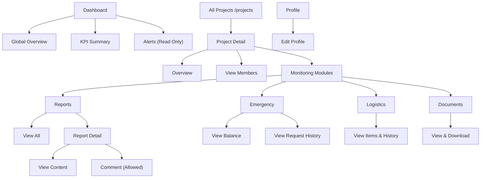
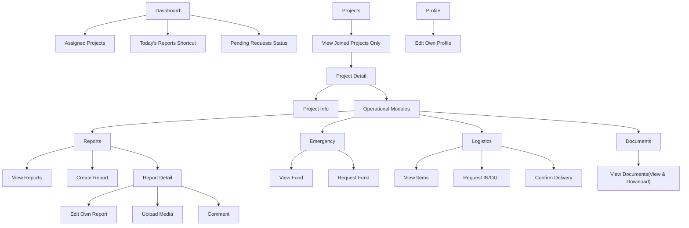
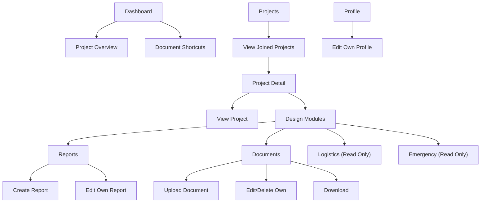
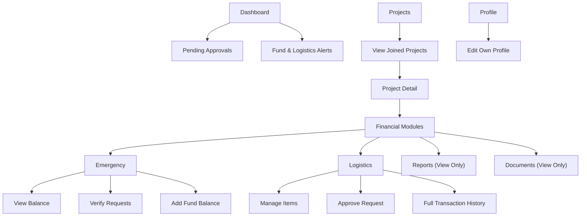

# System UI Flow Map

This document outlines the user interface flow and navigation structure for each role in the Sandaran Internal System.

## Roles Overview

- **ADMIN**: Full system access, management of projects, users, and master data.
- **CEO**: High-level overview, monitoring, and read-only insights.
- **MANDOR**: Project-specific operations, report creation, and logistics requests.
- **ARCHITECT**: Design-focused access, document management, and read-only logistics.
- **FINANCE**: Financial oversight, approval workflows, and transaction history.

---

## Global Navigation Rules

- Routes are not role-specific; access is controlled by permission guards.
- UI elements (menus, buttons) are conditionally rendered based on action permissions.
- Unauthorized access redirects to /403.
- Project routes always require project context validation.

---

## 1. ADMIN Flow

Admins have comprehensive access to all modules.

```mermaid
graph TD
    Dashboard[Dashboard] --> ProjectsSummary[Projects Summary]
    Dashboard --> EmLogStats["Emergency & Logistics Stats"]
    Dashboard --> QuickJump["Quick Jump to Project"]

    Projects["Projects List"] --> CreateProject["Create Project"]
    Projects --> FilterSearch["Search / Filter"]
    Projects --> ProjectDetail["Project Detail /projects/:slug"]

    ProjectDetail --> Overview[Overview]
    ProjectDetail --> EditInfo["Edit Info"]
    ProjectDetail --> ManageMembers["Manage Members"]
    ProjectDetail --> ProjectModules["Project Modules"]

    ProjectModules --> Reports["Reports /reports"]
    Reports --> ViewReports["View All Reports"]
    Reports --> CreateReport["Create Report(Optional / Debug / Override)"]
    Reports --> ReportDetail["Report Detail /reports/:slug"]
    ReportDetail --> EditReport[Edit]
    ReportDetail --> DeleteReport[Delete]
    ReportDetail --> UploadMedia["Upload Media"]
    ReportDetail --> Comment[Comment]

    ProjectModules --> Emergency["Emergency /emergency"]
    Emergency --> FundBalance["View Balance"]
    Emergency --> AllRequests["All Requests"]
    Emergency --> ApproveReject["Approve/Reject"]
    Emergency --> AddBalance["Add Balance"]

    ProjectModules --> Logistics["Logistics /logistics"]
    Logistics --> ViewItems["View Items"]
    Logistics --> CreateEditItem["Create/Edit Item"]
    Logistics --> RequestInOut["Request IN/OUT"]
    Logistics --> ApproveRequest["Approve Request"]
    Logistics --> ConfirmUsage["Confirm Usage"]

    ProjectModules --> Documents["Documents /documents"]
    Documents --> ViewDocs["View All"]
    Documents --> UploadDoc[Upload]
    Documents --> EditDeleteDoc["Edit/Delete"]
    Documents --> DownloadDoc[Download]

    Users["Users Management /users"] --> ListUsers["List All Users"]
    Users --> ApproveUser["Approve/Deactivate"]
    Users --> EditRole["Edit Role"]

    Master["Master Data /master"] --> MasterLogistics["Master Logistics"]
    Master --> MasterEmergency["Master Emergency Categories"]
    Master --> SystemConfig["System Config"]
```

---

## 2. CEO Flow

CEOs focus on High-level overview, monitoring, and read-only insights.

---

## 3. MANDOR Flow

Mandors operate within assigned projects, focusing on daily reporting and logistics.

---

## 4. ARCHITECT Flow

Architects manage designs and documentation.

---

## 5. FINANCE Flow

Finance manages approvals and tracks transactions.

